# Weather-Monitor-BIM v4.1

## I want to present to the public "Weather Monitor" - a device capable of displaying weather forecasts from the Internet on a miniature display.
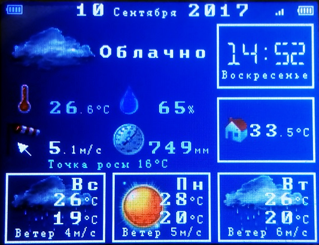
The idea of creating this device was born when I have overslept, and in a hurry, getting ready for work, haven't dressed for the weather ... Frozen, caught in the rain, strong wind... Then I was decided get some kind of weather forecast device somewhere on the way to the exit of the apartment, able to show the latest weather information as much as possible quickly. Since in the morning, usually, there is not enough time to search for weather forecasts on the Internet, in smartphone or switching TV channels. 
After wasteing some time “googling”, I came to the conclusion that the device that I need it’s not for sale anywhere, or rather I didn’t find anything like it at all, or maybe I was looking badly. And since I have some skills in creating kinds of electronic devices, it was decided to come up with my own device. At that time, hand-made devices it was customary to connect to the Internet with a LAN wire through the module on the ENC28J60 chip, or wirelessly via WiFi module ESP8266. Of course, the choice was made in favor of the latter. Because: firstly, without wires in a cramped apartment it’s easier to place the device, and secondly, this WiFi module doesn't need an additional microcontroller as it already contains quite powerful 32 bit 80 MHz microcontroller. The choice is made, it remains only to come up scheme, write firmware, debug, assemble and flash... The simplest actions I have already done, you just have to assemble and flash. 
The device works as follows: when turned on, it connects to your home WiFi network (or to the neighbor's), downloads the weather forecast from the site <a href=http://openweathermap.org target=blank class=link>http://openweathermap.org</a> and shows it on a small display, then the device synchronizes the clock with the NTP server time.windows.com, then the device reads the readings of the built-in temperature and humidity sensor air "in the house" and also shows its value on the display. Then, after a few minutes, the device goes into deep sleep mode, in order to save battery power. Or just stay awake if it has AC power. 
The device layout is very simple and easy to repeat even for a novice radio amateur. 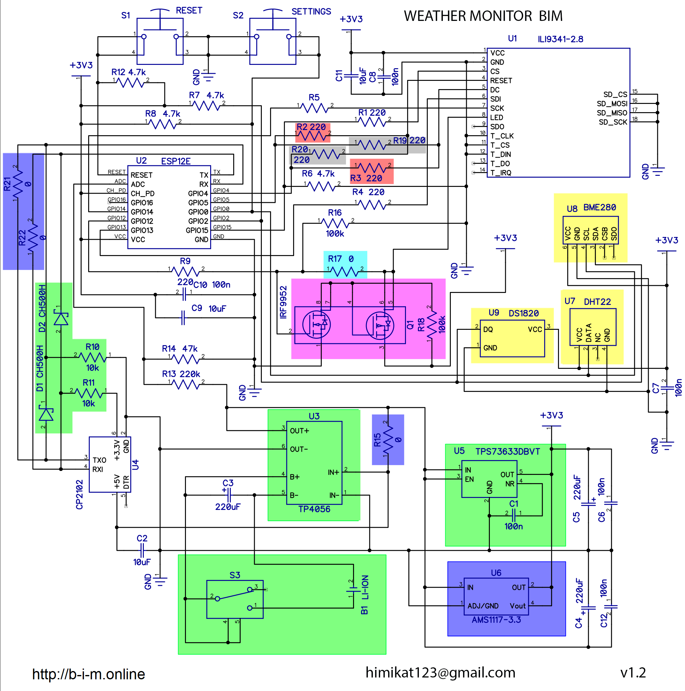 
Green indicates the details that need to be installed if it is planned to power the device from battery. In blue, if the device will only be powered from the AC. Some ESP12 modules come across with mixed GPIO4 and GPIO5 pins, resistors are provided for this case marked in red and gray. Set to either red or gray. If your display module has a backlight control transistor, install a resistor marked in turquoise color. If not, you will have to install a transistor assembly and a resistor marked in purple so as not to burn the output of the ESP8266. Yellow temperature and/or humidity sensors, which can not be installed, or set only those that are needed.

The heart of the device is the ESP-12E module, it must have at least 8 Mbps (or 1 Mb) flash memory, if less - the firmware will not fit. Check with the seller before buying. 
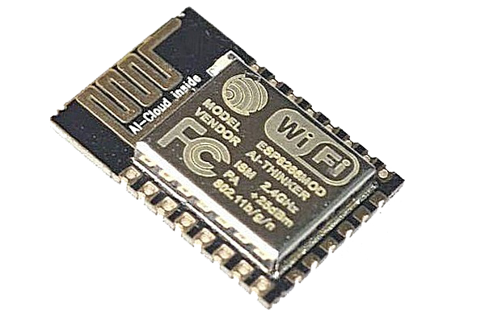

The display is also modular, 2.8 inches, SPI, 3.3 volts. This display module has a built-in voltage converter 5 -> 3.3 volts which must be disconnected by soldering jumper J1 shown in the figure. 

The USB->UART converter on the CP2102 chip is also in a modular design. Since the module is easier to solder, than a microcircuit, the cost of the module is less, and you do not need to bother with the strapping.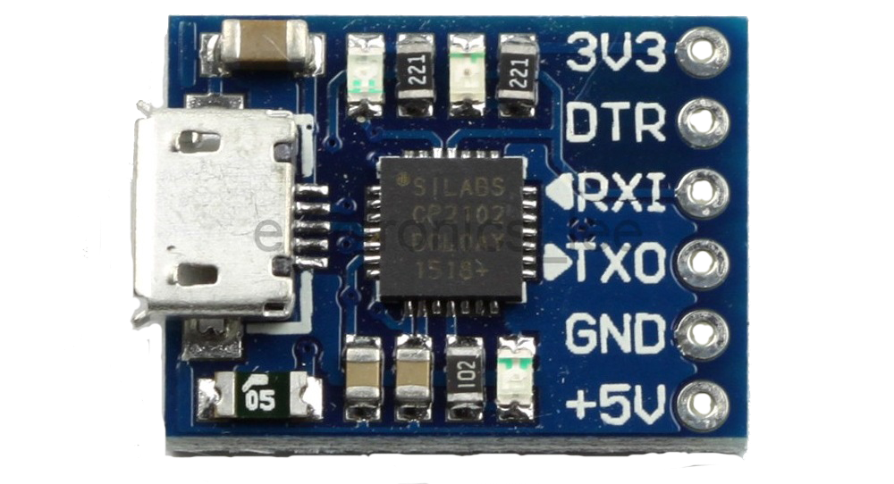

To charge the built-in Li-pol battery, the TP4056 chip is used. Also, by due to low cost and reluctance to bother with strapping applied module. Before installing the module, it is desirable to remove the mini/micro-USB connector from it, since it is in this device is not needed. We will charge the device through a micro-USB connector which is on the CP2102 module.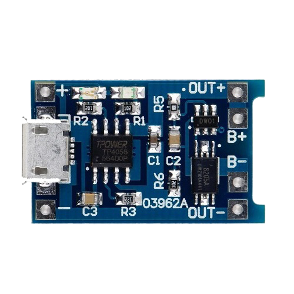

All modules and other discrete elements are mounted on a single-sided printed circuit board. The PCB is hand-made its manufacture should not cause difficulties, since the width tracks and the distance between them is quite large.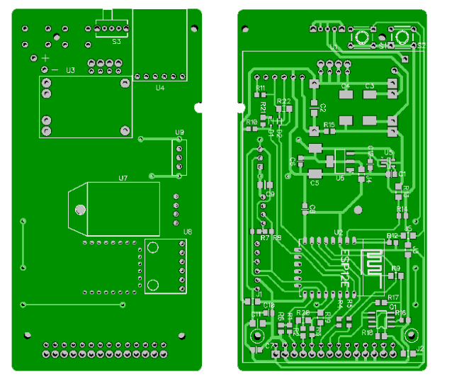

After assembly the gadget must be flashed. Use the <a href="?p=flashing" class="link">firmware guide</a>.

Go to the gadget's settings: Press and release the RESET button, press and hold the SETTINGS button until instructions on entering the settings mode appear on the screen of the gadget.  
You can use a laptop, tablet, or smartphone. Connect it to the "WeatherMonitor" network, the default password is "1234567890" Open your browser and go to the address http://192.168.4.1 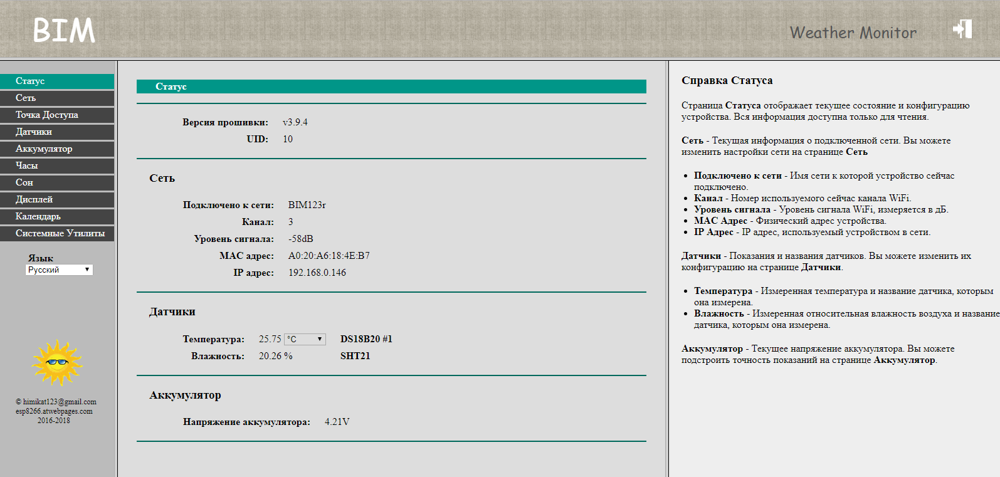

The case of the device is printed on a 3d printer and consists of several parts of different colors glued together between each other. The appearance resembles an old TV, even “antennas” are present. One from the “antennas” this is a DS18B20 temperature sensor, it is moved outside the case so that its readings more truthful. The second "antenna" is any transistor, not connected anywhere, decorative. 

<a href="?p=mon3d" class=link>here</a> you can see and twist 3d models of the board and the assembled device. 

And finally, a few photos of the resulting gadget.
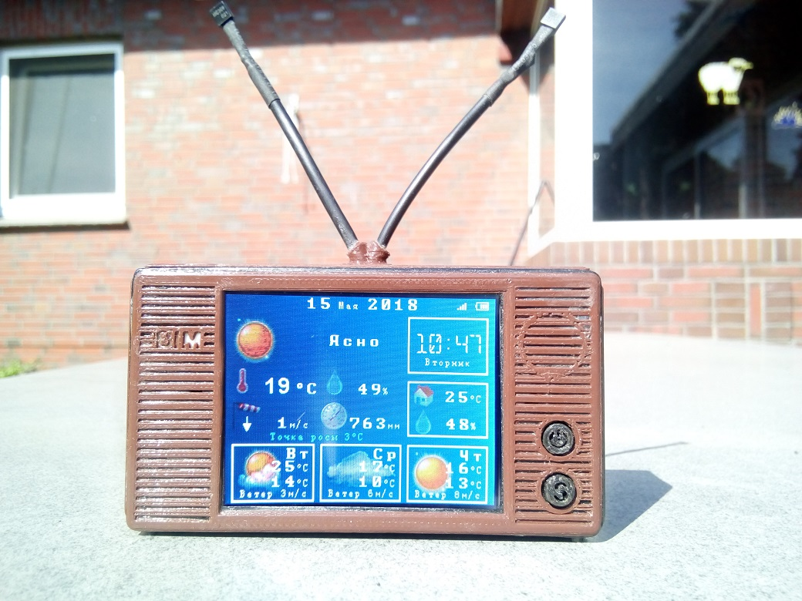
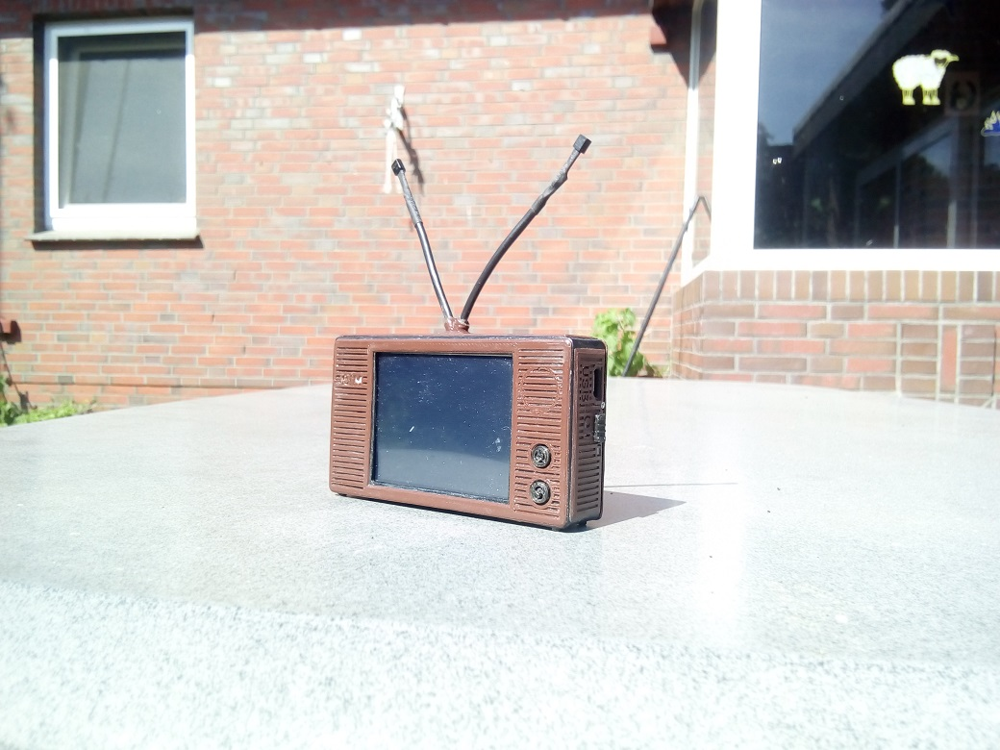
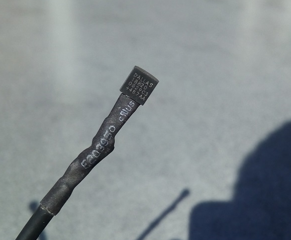
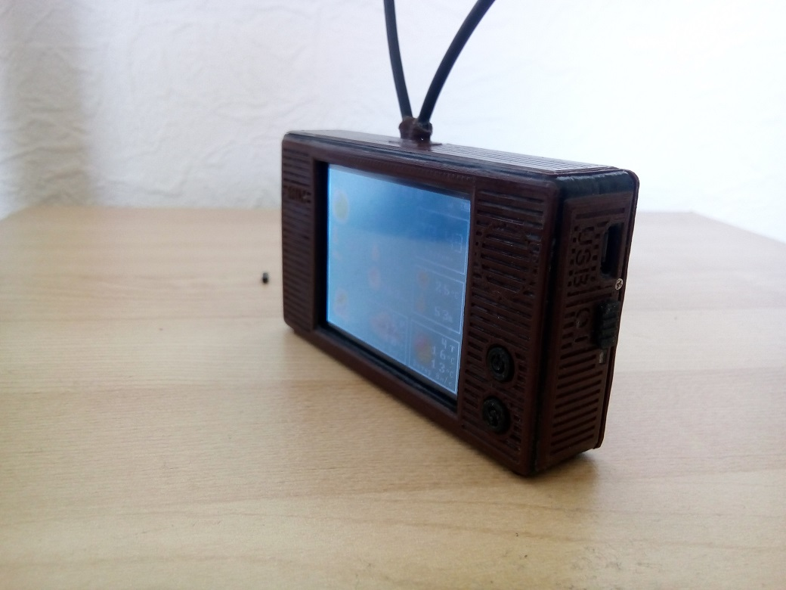
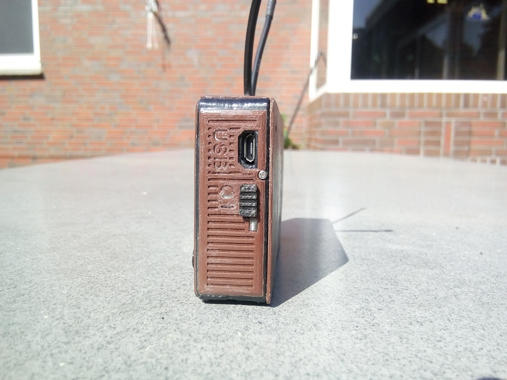
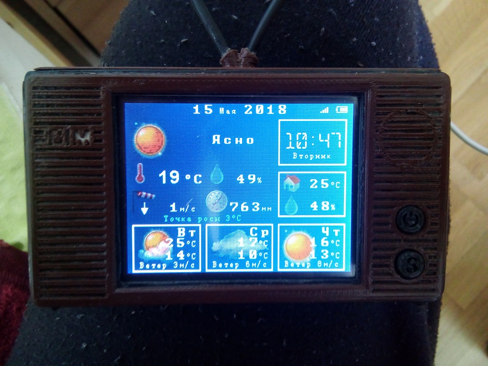
A small video of the gadget
<iframe src="https://www.youtube.com/embed/-WY_yKaUAVI" frameborder="0" allowfullscreen></iframe>

Versions history:
v1.0 The first release.
v1.1 If the gadget is powered from AC, it is always on, sleep mode is not needed.
v1.2 You can turn off sleep mode, or adjust the time after which the gadget falls asleep.
v1.3 Added the ability to connect to a hidden network, and enter the IP address manually.
v2.0 Now you can connect a wireless outside sensor.
v2.1 The width of the field with the clock is now equal to the width of the field with the house (on the screen).
v2.2 You can save up to 10 WiFi networks, the weather monitor itself will connect to one of them.
v2.3 Significantly redesigned screen design. Everything significant has become larger: values, pictures, hours. If you have an outside sensor, the charge level will be displayed in the upper left corner sensor’s batteries, and blue circles will appear to the right of temperature, humidity, pressure, if these parameters are taken from the sensor.
Now, if the "no sleep" mode is turned on - data weather updates every three minutes.
v2.4 If the connection to the access point is lost, the weather monitor will display a crossed out antenna and will try to reconnect. If in a reasonable period of time the connection cannot be restored, dashes will be displayed instead of the weather forecast, while the gadget will continue to attempt to reconnect.
v2.5 Fixed incorrect function of settings page in many well-known browsers. The settings page was tested in browsers: Google Chrome, Opera, Firefox, Internet Explorer 8-11, Microsoft Edge. In operating systems: Windows XP, 7, 8.1, 10, Android 4.1, 4.2, 5.0, 6.1, Ubuntu 16.04.
v2.6 New design, author of the design "почемучка". Added Lithuanian, author of the translation "detale". Estonian language added, author of the translation "MOHCTEP". Bug fixed, the wind direction arrow no longer points in the opposite direction, thanks "vladimirk68". Added new parameter "dew point" thanks to "m169". Some weather icons are now different for day and night modes.
v2.6.1 Bug fixed, the temperature in the house was not updated.
v2.7 Added Ukrainian language, the author of the translation "nbo". The brightness of the backlight can now adjust separately for day and night modes. Battery voltage now measured in volts (measure the real voltage and adjust if necessary).
v3.0 Added weather forecast source selection, except openweathermap.org can now take weather with wunderground.com. In this case, the daily forecast is formed when help of esp8266.atwebpages.com, because the ESP8266 module does not have enough memory parsing so much information. Added support for temperature sensors and humidity levels of DHT22 and BME280. Battery level can be displayed in the form of a pictogram or to see the voltage in numbers (on the screen), or even turn off charge display. Weather descriptions ("Cloudy", "Snow and Rain", etc.) from the site openweathermap.org is now translated into Russian by a translator and has become more meaningful, thanks to "vladimirk68". If sleep mode is turned on - update Weather occurs every 20 minutes.
v3.1 Since October 2017 openweathermap.org made the weather forecast API by days on a paid basis, many who have registered an APPID key later than September do not showed a daily forecast. In this firmware version, the daily forecast is formed from hourly forecast, which remained free. And it is formed using the site esp8266.atwebpages.com, because the ESP8266 module does not have enough memory for parsing such a volume of information.
v3.2 Added the ability to read the outside sensor data directly, without a router and going to the Internet. Added Azerbaijani language, the author of the translation "Anar". Temperature in the house and the street are rounded to the nearest degree.
v3.3 Added Belarusian language, author of the translation "Дмитрий".
v3.4 Fixed a bug with the going to daylight saving time, more precisely with the cancellation of this transition.
v3.5 Added support for temperature and humidity sensor SHT21, thanks "Anar" for kindly provided sensor. Added ability to correct temperature sensor readings and humidity, if these sensors are not precisely.
v3.6 The need for authorization to access the settings page (default username:"admin" password:"1111") The new interface for the settings page. Minimum help for each setting item. Access to the settings page without entering the device into the settings mode. Access to the page settings by registered address, and not just by IP address. For example http://weathermonitor.local Selection of units of measurement and rounding of data (temperature, humidity, pressure and wind speed).
v3.7 Yahoo Weather Provider added. Possibility to adjust data from Internet and outside sensor. Receive data from the sensor through thingspeak.com. Removed dew point. Instead, the date and time of the last update of the weather forecast is displayed. A bar is displayed to the right of the current weather, the shorter the bar - the sooner the following will happen weather forecast update.
v3.8 Fixed glitches/artifacts of home temperature and humidity. Fixed bug with rounding humidity in the house. Fixed a bug of not updating/not displaying the weather after turning off the power. Download speed increased slightly. Added Bulgarian language. Translated by "mitre". Added by the choice of a WiFi channel and the ability to create a hidden network in the access point mode.
v3.9 Added the ability to colorize the screen with your own colors. Added a calendar of events. Device can now wish you a happy birthday and remind you of the holidays. Added display of sunrise and sunset times.
v3.9.1 Fixed missing date and year on the top line. Fixed trimming of long text in calendar of events.
v3.9.2 Added definition of the city by coordinates and ID. Added setting for switching to night and daily time mode set by the user.
v3.9.3 Fixed the error of the disappearance of the sensor after switching to daylight saving time, for countries where this transition canceled. Added the ability to connect a "wired" outside sensor. Version with OTA support
v3.9.3_OTA Special version with support for firmware updates over the air. Attention! for the OTA version, the ESP12 module must have minimum 4MB flash.
v3.9.4 Fixed bug of not updating wired outside sensor.
v3.9.4_OTA Special version with support for firmware updates over the air. Attention! for the OTA version, the ESP12 module must have minimum 4MB flash.
v3.9.4_fw Firmware for flashing over the air
v4.0 The dependence of the weather monitor on the home site (http://esp8266.atwebpages.com)(which closed on September 10, 2019) has been fixed. Added weather forecast provider http://apixu.com. You can no longer change the colors of the text/background of the display (because without the help of the home site (which was closed) this function can't work).
v4.1 Added weather source https://www.weatherbit.io thanks max50! Who has a new key from openweathermap and does not show a forecast for 3 days, will now show The weather forecast provider http://apixu.com has been removed (since it was closed).

<a href="http://radiokot.ru/forum/viewtopic.php?f=2&t=144411" target="blank" class="link">Forum in russian language</a>
