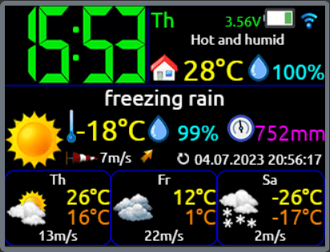
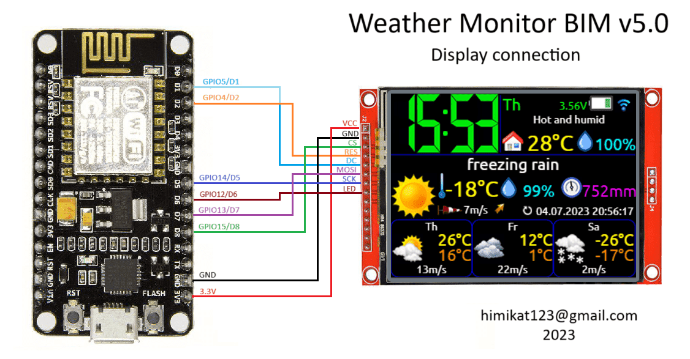
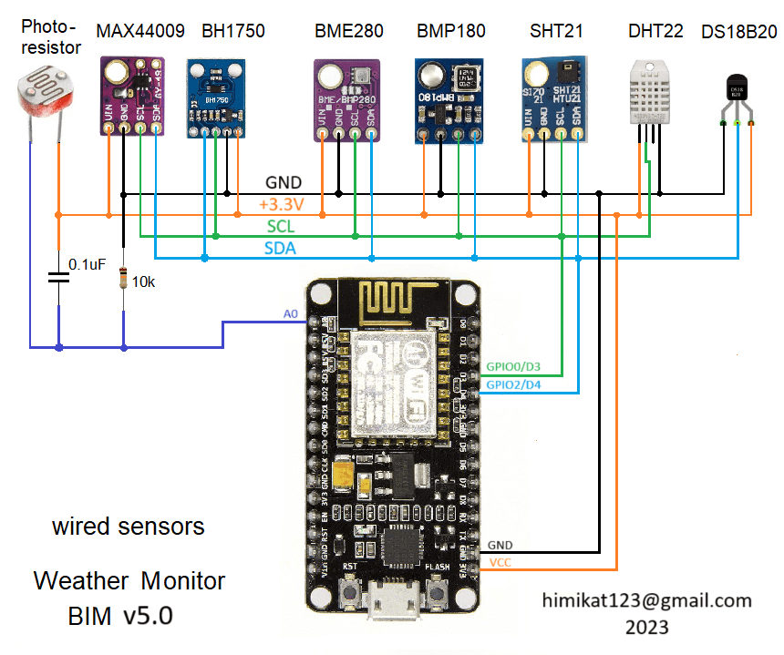
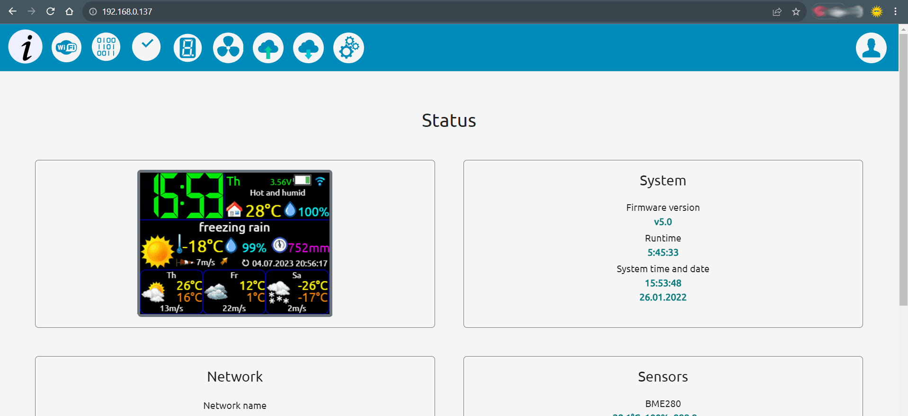

# BIM weather monitor
## Weather monitor on ESP8266

### Brief list of weather monitor features:

* Connect to home WiFi network 2.4 GHz
* Display current weather and weather forecast for 2 days
* Display temperature and humidity in the house
* Clock with NTP synchronization
* Sending and/or receiving data from/to thingspeak
* Sending data to narodmon
* Wireless temperature/pressure/humidity/ambient light sensors
* Support wired temperature/pressure/humidity/ambient light sensors
* Auto-adjust the brightness of the screen backlight (by ambient light sensor, by time or by the fact of sunrise and sunset)
* ILI9341 color display
* Support 2 languages: English, Russian
* Very flexible settings via web interface

## Wiring diagram for base weather monitor modules
To start and operate the weather monitor, just connect **display** to **ESP8266**. Connecting all other modules is optional.

Instead of diagrams I post half-drawings/half-photos, so that it is clear to beginners and even non-professionals. I ask professionals not to be upset, normal schematic diagramm will also be.

## Scheme of connecting wired sensors to the weather monitor
To the **weather monitor** can be connected to wired sensors for temperature, humidity, pressure and ambient light. **The monitor** supports the following sensors:
* BME280
* BMP180
* SHT21
* DHT22
* DS18B20
* MAX44009
* BH1750
* photoresistor

You can connect any one, several, or all sensors from this list at once. The connection diagram is as follows.

## Weather monitor schematic diagramm

Well, as promised, a normal schematic diagramm for general development. 

## Weather monitor firmware

To flash **ESP8266**:
1. Add **ESP8266** support to **Arduino IDE**, find [instruction](https://www.google.com/search?q=arduino+ide+install+esp8266&newwindow=1&sca_esv=556563504&biw=1536&bih=739&ei=IhjZZLShKNmLi-gP3saC8Ak&ved=0ahUKEwi0upvEmdqAAxXZxQIHHV6jAJ4Q4dUDCBA&oq=arduino+ide+install+esp8266&gs_lp=Egxnd3Mtd2l6LXNlcnAiG2FyZHVpbm8gaWRlIGluc3RhbGwgZXNwODI2NjIFEAAYgAQyBhAAGBYYHjIGEAAYFhgeMgYQABgWGB4yBhAAGBYYHjIGEAAYFhgeMgYQABgWGB4yBhAAGBYYHjIGEAAYFhgeSKwrUKcHWMYccAR4AZABAJgBhAGgAdoGqgEDNi4zuAEMyAEA-AEBwgIKEAAYRxjWBBiwA8ICBxAhGKABGArCAgUQIRigAeIDBBgAIEGIBgGQBgg&sclient=gws-wiz-serp)
2. Add to **Arduino** plug-in for upload **LittleFS** find [instruction](https://www.google.com/search?q=esp8266+littlefs+sketch+data+upload+tool&newwindow=1&sca_esv=556563504&ei=aRjZZIXpFsGCi-gPqOGs-Ao&oq=esp8266+littlefs+data+upload+tool&gs_lp=Egxnd3Mtd2l6LXNlcnAiIWVzcDgyNjYgbGl0dGxlZnMgZGF0YSB1cGxvYWQgdG9vbCoCCAAyCBAhGKABGMMESMdhUIwLWOBDcAF4AZABAJgBlAGgAYwPqgEEMTguNLgBA8gBAPgBAcICChAAGEcY1gQYsAPCAgkQABgNGBMYgATCAgUQABiiBMICCBAAGAcYHhgTwgIHEAAYExiABMICBhAAGAcYHsICBBAAGB7CAgoQIRigARjDBBgK4gMEGAAgQYgGAZAGCA&sclient=gws-wiz-serp)
3. Unpack the libraries from the file **libraries.zip** to the folder C:/Users/**Username**/Documents/Arduino/libraries
4. Flash the board with the sketch
5. Flash the files of the **LittleFS** file system: in Arduino you need to select **Tools --> ESP8266 LittleFS Data Upload**

After the flashing **the weather monitor** needs to be configured. An unconfigured device turns on the access point mode (creates a WiFi network) **Weather monitor BIM** with the default network password **1234567890**. And in the future to turn it on again you need to press and hold the **Settings** button until the access point symbol appears on the screen instead of the antenna symbol. After connecting a laptop or a smartphone to the **Weather monitor BIM** network, open a browser and navigate to **http://192.168.4.1**. If needed enter login **admin** and password **1111** to open the settings page. In the future, for security reasons, it is recommended to change the default password.

Also when the device is already configured and connected to the network you can get into the settings without pressing the **Settings** button just enter the IP address of the **weather monitor** in the browser.

## A demo of the settings page can be viewed <a href="https://bim32demo.000webhostapp.com/" target="_blank">here</a>

## Do you like the project? Buy me a coffee or a beer.

