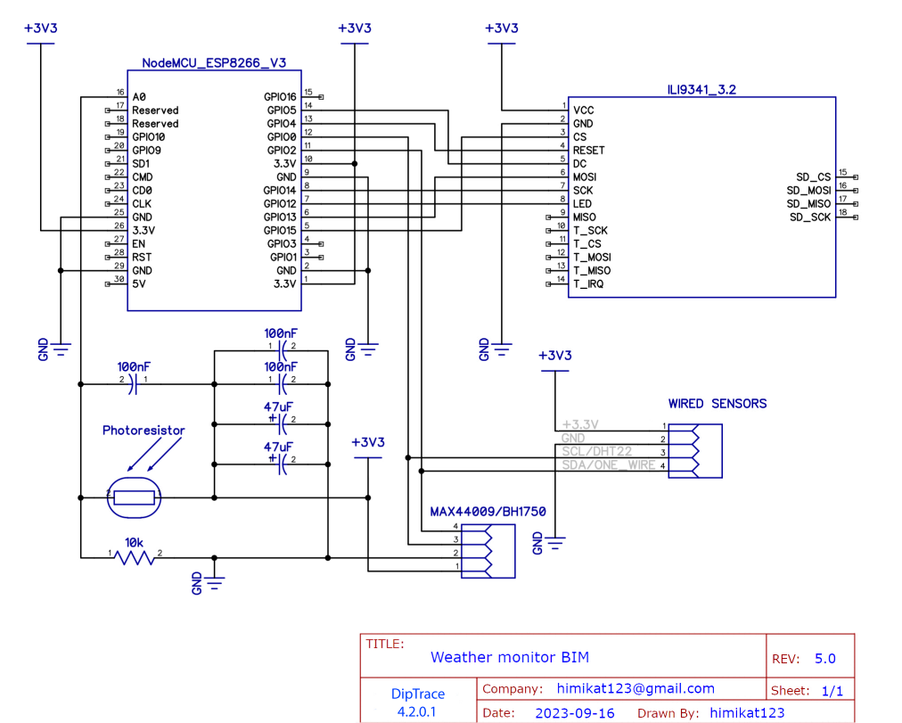

 

# Монитор погоды BIM
## Монитор погоды на ESP8266

 

### Краткий список возможностей монитора погоды:

* Подключение к домашней WiFi сети 2.4 гГц
* Отображение текущей погоды и прогноза погоды на 2 дня
* Отображение температуры и влажности в доме
* Часы с синхронизацией NTP
* Отправка и/или прием данных с/на сервис thingspeak
* Отправка данных на народный мониторинг
* Беспроводной датчик температуры/давления/влажности/освещенности
* Поддержка проводных датчиков температуры/давления/влажности/освещенности
* Авторегулировка яркости подсветки экрана (по датчику освещенности, по времени или по факту рассвета и заката)
* Цветной дисплей ILI9341
* Поддержка 2 языков: Английский, Русский
* Очень гибкие настройки через веб интерфейс

## Схема подключения базовых модулей монитора погоды
Для запуска и работы монитора погоды достаточно соединить **дисплей** с **ESP8266**. Подключение всех остальных модулей является необязательным. 

Выкладываю вместо схем полурисунки/полуфотографии, чтоб было понятно и начинающим и даже непрофессионалам. Профессионалов прошу не расстраиваться, нормальная схема тоже будет.

## Схема подключения проводных датчиков к монитору погоды
К **монитору погоды** можно подключить проводные датчики температуры, влажности, давления и уровня освещенности. **Монитор** поддерживает следующие датчики: 
* BME280
* BMP180
* SHT21
* DHT22
* DS18B20
* MAX44009
* BH1750
* фоторезистор

Можно подключить любой один, несколько, либо сразу все датчики из этого списка. Схема подключения следующая.

## Схема монитора погоды

Ну и, конечно, нормальная общая схема для общего развития.

## Прошивка монитора погоды

Для прошивки **ESP8266** бинарником:
1. Скачиваем flash_download_tools от Espressif
2. Ставим галочки как на скриншоте
3. Выбираем бинарник прошивки и номер COM-порта
4. Жмем кнопку Start

Или, чтоб скомпилировать и прошить через Ардуино **ESP8266**: 
1. Добавляем в **Arduino IDE** поддержку **ESP8266**, находим [инструкцию](https://www.google.ru/search?q=arduino+esp8266+%D1%83%D1%81%D1%82%D0%B0%D0%BD%D0%BE%D0%B2%D0%BA%D0%B0&newwindow=1&sca_esv=556551428&bih=739&biw=1536&hl=ru&ei=lhHZZLeeKK7_7_UPkau0wAs&oq=arduino+esp8266+%D1%83%D1%81%D1%82&gs_lp=Egxnd3Mtd2l6LXNlcnAiFmFyZHVpbm8gZXNwODI2NiDRg9GB0YIqAggAMgUQABiABEjaIFD3AViBFnABeAGQAQCYAWagAdwCqgEDMy4xuAEDyAEA-AEBwgIKEAAYRxjWBBiwA8ICChAAGIoFGLADGEPiAwQYACBBiAYBkAYK&sclient=gws-wiz-serp)
2. Добавляем в **Ардуино** плагин для заливки **LittleFS** находим [инструкцию](https://www.google.ru/search?q=arduino+esp8266+littlefs+%D0%BF%D0%BB%D0%B0%D0%B3%D0%B8%D0%BD&newwindow=1&sca_esv=556551428&bih=739&biw=1536&hl=ru&ei=ohHZZOGaGZqW9u8PlO-8GA&oq=arduino+esp8266+littlefs+%D0%BF%D0%BB%D0%B0&gs_lp=Egxnd3Mtd2l6LXNlcnAiH2FyZHVpbm8gZXNwODI2NiBsaXR0bGVmcyDQv9C70LAqAggBMgUQIRigATIFECEYoAEyBRAhGKABMgUQIRigATIFECEYoAFIlm1QjAhY_2FwA3gBkAEAmAGLAaABlxCqAQQxOS40uAEDyAEA-AEBwgIKEAAYRxjWBBiwA8ICBRAAGIAEwgIGEAAYFhge4gMEGAAgQYgGAZAGCA&sclient=gws-wiz-serp)
3. Распаковываем библиотеки из файла **libraries.zip** в папку C:/Users/**Username**/Documents/Arduino/libraries
4. Прошиваем плату скетчем
5. Прошиваем файлы файловой системы **LittleFS**, в Ардуино нужно выбрать **Инструмены --> ESP8266 LittleFS Data Upload**

После прошивки **монитор погоды** нужно настроить. Ненастроенный прибор сам включает точку доступа (создает WiFi сеть) **Weather monitor BIM** с паролем сети по умолчанию **1234567890**. А в дальнейшем, чтоб ее снова включить, нужно нажать и удерживать нажатой кнопку **Settings**, пока на экране вместо символа антенны не появится символ точки доступа. Подключив ноутбук или телефон к сети **Weather monitor BIM** нужно открыть браузер и перейти по адресу **http://192.168.4.1**. Если понадобится - введите логин **admin** и пароль **1111**, чтоб открыть страницу настроек. В дальнейшем, в целях безопасности, рекомендуется сменить пароль по умолчанию.

Также, когда прибор уже настроен и подключен к сети, в настройки можно попасть и без нажатия кнопки **Settings**, достаточно ввести в браузере IP-адрес **монитора погоды**.

И, напоследок, несколько фоток получившегося девайса

    
    
    
    
    

## Нравится проект? Угости меня кофейком, или пивком.

